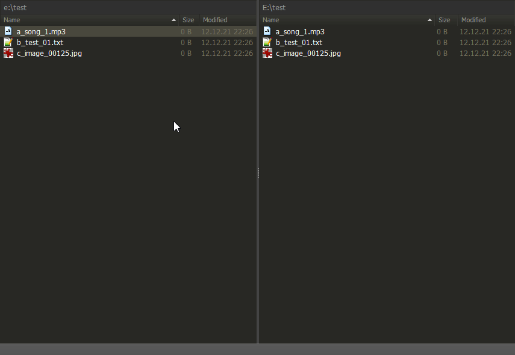

# fman duplicate file and increment index extension
duplicate the currently selected file from [FMan](https://www.fman.io) with ctrl+d and increment the index

# Install
install the plugin by copying the release to 
> %AppData%\Roaming\fman\Plugins\User

Or just use the "install plugin" function from within fman and search for FManDuplicateFilesAndIncrementExtension.

# Usage
Select one or more files and press ctrl+d

The files will be copied and the file index will be incremented.

For this to work you need to name your files like *FILENAME_####.extension*

## Examples

- test_1.jpg will be duplicated to test_2.jpg
- test_0000001.txt will be copied to test_0000002.txt

You can also select multiple files and duplicate them.
Note that files that already exist will not be overwritten.

